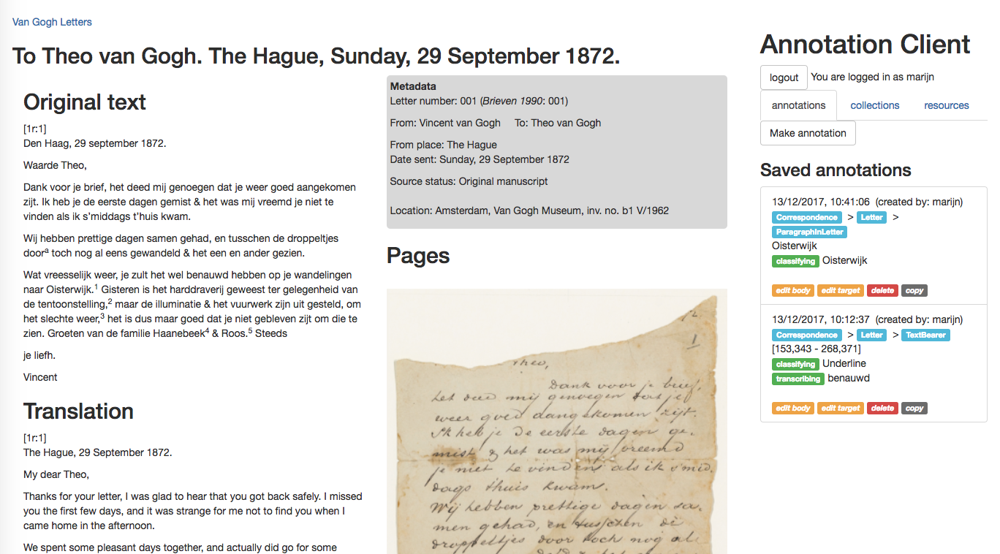
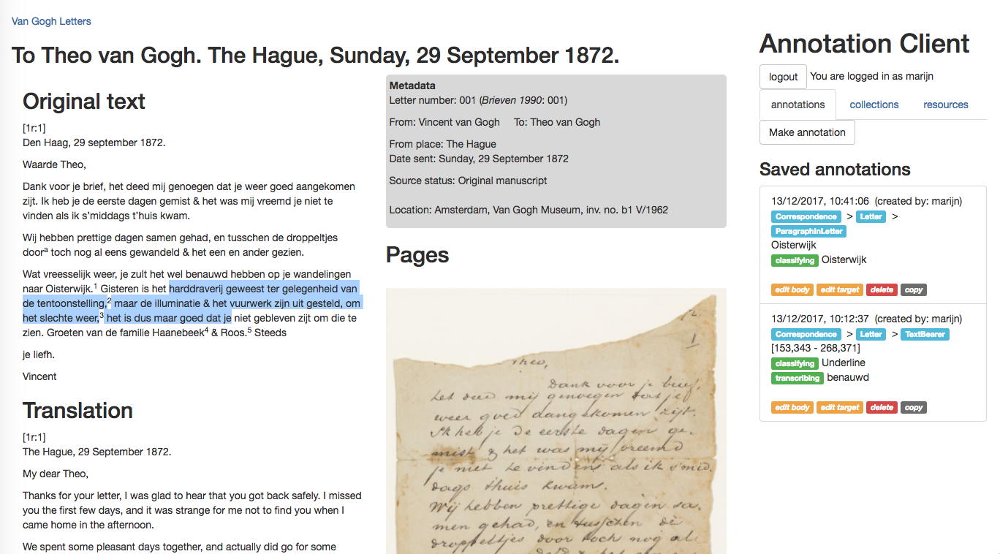
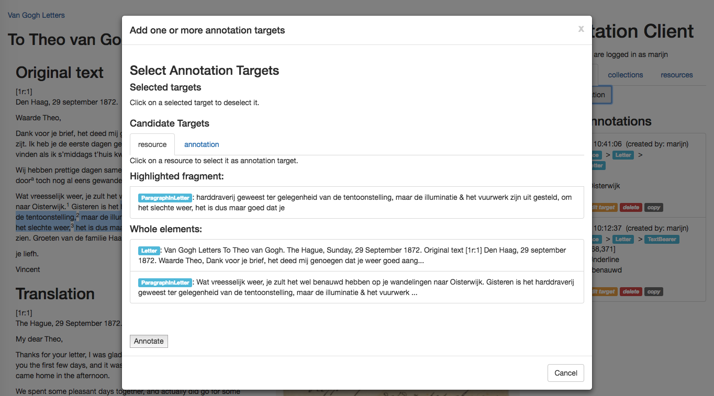
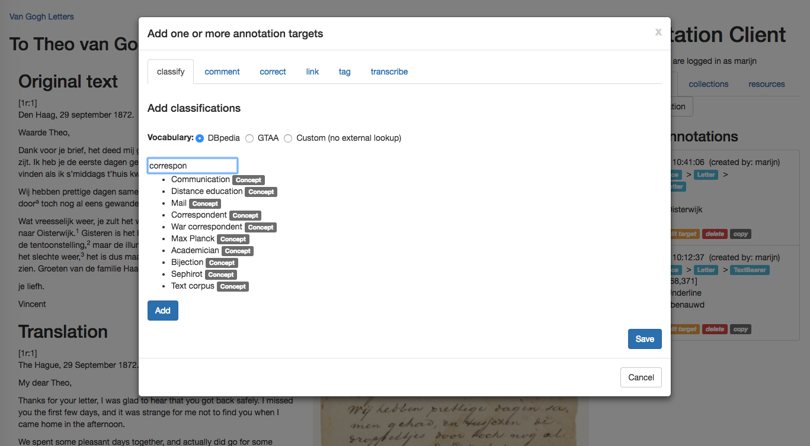
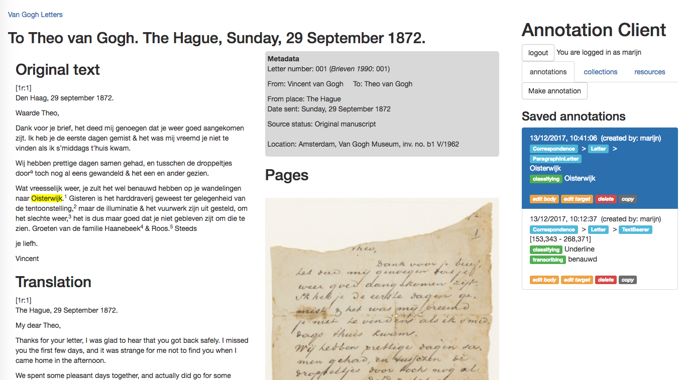
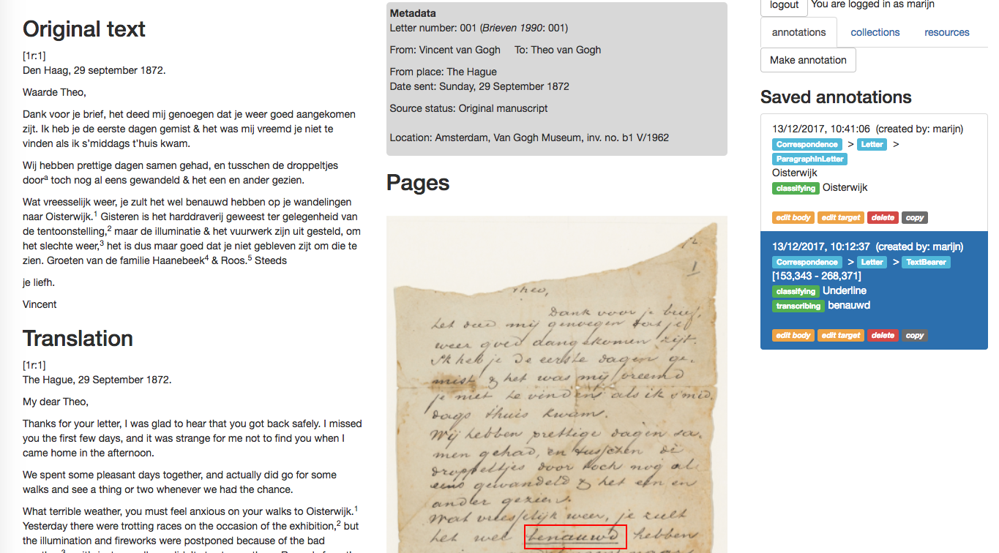

# Scholarly Web Annotation Client

The Scholarly Web Annotation (SWA) client is a Javascript annotation client for RDFa enriched web resources based on the W3C Web Annotation standard. This client is developed by the [Netherlands Institute for Sound and Vision](http://labs.beeldengeluid.nl/) and [Huygens ING](https://www.huygens.knaw.nl/?lang=en) for the research infrastructure project [CLARIAH](https://www.clariah.nl/en/). It is being developed in tandem with the [Scholarly Web Annotation Server](https://github.com/marijnkoolen/scholarly-web-annotation-server).

+ [Embedding the SWA Client](#embedding-the-swa-client)
+ [Using the SWA Client](#using-the-swa-client)
+ [Modifying the SWA Client](#modifying-the-swa-client)
+ [Scholarly Web Annotation Ontology](https://github.com/CLARIAH/scholarly-web-annotation-client/blob/master/docs/annotation_ontology.md) introduces an ontology that extends FRBRoo and CIDOC-CRM concepts, to exploit the possibility of annotating a resource on different conceptual levels (e.g. work, manifestation, expression).
+ [Scholarly Web Annotation Data Model](https://github.com/CLARIAH/scholarly-web-annotation-client/blob/master/docs/data_models.md) Extends the [W3C Web Annotation Data model](https://www.w3.org/TR/annotation-model/).
+ [Access permissions](https://github.com/CLARIAH/scholarly-web-annotation-client/blob/master/discussion/handling-permissions.md) discusses a proposal for handling access permissions for scholarly web annotations.

<a name="embed"></a>
## Embedding the SWA Client

### Loading Client Dependencies

1. Load the CSS files by adding the following into the `<head>`

```html
<link rel="stylesheet" href="dist/swac.css"/>
```

2. Load the JS files by adding the following just before the closing `</body>`

```html
<script src="dist/vendor.js"></script>
<script src="dist/swac.js"></script>
```

### Configuring the Client

The configuration consists of four parts:

1. `targetObserver`: this configures the part of the DOM that should be scanned for RDFa information and that can be targetted for annotation. It consists of three properties:
    - 1) `targetObserverClass` is the class name that the client will use to select HTML DOM elements to consider as annotatable objects. It is possible to specify multiple `observer target` elements. The SWA client starts a watcher that will re-initialise the client when anything in the `observer target` elements change. This allows you to use the SWA client with dynamic content, such as search results.
    - 2) `observeMutations`: a boolean indicating whether the client should reload when there are any mutations in the DOM elements that belong to the observer class.
    - 3) `observerConfig`: an object configuring which type of mutations to listen for, i.e. changes in the `childList`, `attributes`, `characterData` and/or the `subtree`. Each type can be switched on or off (default) through a boolean value.

2. `services`: here you can specify addresses for APIs, including the annotation server that the SWA client will use for sending and retrieving annotations, and APIs for vocabularies that the client can use for classifying and linking annotation targets.

3. `annotationTasks`: here you can specify which types of annotations you want to the SWA client to offer. These are based on the [W3C Annotation Model Motivations](https://www.w3.org/TR/annotation-model/#motivation-and-purpose), but you can also create new motivations (see the [W3C Annotation Vocabulary](https://www.w3.org/TR/annotation-vocab/#extending-motivations) on how to extend the list of motivations). Each task has a `type` and a `purpose` property. The `type` property is used as a label presented to the user to identify the type of each annotation. The `purpose` property relates to the W3C Motivation and is added to the underlying W3C annotation as the purpose of a specific annotation body.

4. `defaults`: here you can specify defaults for certain aspects of the annotation process, including the default target types. This is an efficient way to provide users with a default list of annotation targets based on the vocabulary with which the annotatable objects in the DOM are described. For instance, in the example of the Van Gogh correspondence, if the edition maintainer expects most users will want to annotate the paragraphs of letters, they can set `Paragraphinletter` as the default target type. When a user then hit the `Make annotation` button, the client lists the individual paragraphs as default targets.

5. `baseAnnotationOntologyURL`: a URL specifying the base ontology for deriving hierarchical relationships between annotatable resources. 

Put the configuration in a JSON object (into a ``<script>``) after the ones you added in the previous step:

```json
{
    "targetObserver": {
        "targetObserverClass": "annotation-target-observer",
        "observeMutations": true,
        "observerConfig": {
            "childList": true,
            "attributes": true,
            "subtree": true
        }
    },
    "services" : {
        "AnnotationServer": {
            "api": "http://localhost:3000/api"
        },
        "DBpedia": {
            "api": "http://lookup.dbpedia.org/api/search.asmx/PrefixSearch?QueryClass=&MaxHits=10&QueryString="
        }
    },
    "annotationTasks" : {
        "bookmark" : {
            "type": "bookmark",
            "purpose": "bookmarking"
        },
        "classify" : {
            "type": "classification",
            "purpose": "classifying",
            "vocabularies" : [
                "DBpedia"
            ]
        },
        "comment" : {
            "type": "comment",
            "purpose": "commenting"
        },
        "correct" : {
            "type": "correction",
            "purpose": "correcting"
        },
        "link" : {
            "type": "link",
            "purpose": "linking",
            "apis" : [
                {"name" : "wikidata"},
                {"name" : "europeana"}
            ]
        },
        "tag": {
            "type": "tag",
            "purpose": "tagging",
            "specifies": "classify"
        },
        "transcribe" : {
            "type": "transcription",
            "purpose": "transcribing"
        }
    },
    "defaults": {
        "target": ["ParagraphInLetter", "Note", "LocationNote", "SourceNote"]
    },
    "baseAnnotationOntologyURL": "http://boot.huygens.knaw.nl/vgdemo/editionannotationontology.ttl"
}
```

### Adding the Client to the Page

Once you have a SWA client configuration, you can instantiate a client object and insert in the page. In the example below, the viewer is inserted in a DOM element with id `swac-viewer`:

```js
annotator = new ScholarlyWebAnnotator.ScholarlyWebAnnotator(config); // instantiate client with configuration
var viewerElement = document.getElementById('swac-viewer'); // select DOM element to attach client to
annotator.addAnnotationClient(viewerElement); // insert client in the DOM
```

### A complete example

Here is a complete example to demonstrate how you can setup a web page with an RDFa-enriched resource and a fully-configured annotation client. This example assumes four files sitting in the same web directory that is served over HTTP: the SWA client library (`scholarly-web-annotator.js`), a configuration file (`annotator_config.json`), a loading script to configure and embed the client (`load_annotator.js`) and an HTML file with the RDFa-enriched resource (`index.html`).

*Note that in the config below, you have to fill the address of a running [SWA server](https://github.com/marijnkoolen/scholarly-web-annotation-server)!*

The SWA client modules can be found in the [releases](https://github.com/CLARIAH/scholarly-web-annotation-client/releases) page.

`annotator_config.json`:

```json
{
    "targetObserver": {
        "targetObserverClass": "annotation-target-observer",
        "observeMutations": true,
        "observerConfig": {
            "childList": true,
            "attributes": true,
            "subtree": true
        }
    },
    "services" : {
        "AnnotationServer": {
            "api": "http://<annotation.server.address>/api"
        },
        "DBpedia": {
            "api": "http://lookup.dbpedia.org/api/search.asmx/PrefixSearch?QueryClass=&MaxHits=10&QueryString="
        }
    },
    "annotationTasks" : {
        "bookmark" : {
            "type": "bookmark",
            "purpose": "bookmarking"
        },
        "classify" : {
            "type": "classification",
            "purpose": "classifying",
            "vocabularies" : [
                "DBpedia"
            ]
        },
        "comment" : {
            "type": "comment",
            "purpose": "commenting"
        },
        "correct" : {
            "type": "correction",
            "purpose": "correcting"
        },
        "link" : {
            "type": "link",
            "purpose": "linking",
            "apis" : [
                {"name" : "wikidata"},
                {"name" : "europeana"}
            ]
        },
        "tag": {
            "type": "tag",
            "purpose": "tagging",
            "specifies": "classify"
        },
        "transcribe" : {
            "type": "transcription",
            "purpose": "transcribing"
        }
    },
    "defaults": {
        "target": ["ParagraphInLetter", "Note", "LocationNote", "SourceNote"]
    },
    "baseAnnotationOntologyURL": "http://boot.huygens.knaw.nl/vgdemo/editionannotationontology.ttl"
}
```

`load_annotator.js`:

```js
var configFile = "annotator_config.json"; // location of the config file

document.onreadystatechange = function () { // wait till page is loaded
    if (document.readyState === "complete") {
        loadConfig(function(error, config) { // load configuration file
            if (error)
                return null;
            // instantiate, configure and insert client
            annotator = new ScholarlyWebAnnotator.ScholarlyWebAnnotator(config);
            var viewerElement = document.getElementById('swac-viewer');
            annotator.addAnnotationClient(viewerElement);
        });
    }
}

var loadConfig = function(callback) {
    var xhr = new XMLHttpRequest();
    xhr.open("GET", configFile);
    xhr.onreadystatechange = function() {
        if (xhr.readyState === XMLHttpRequest.DONE) {
            try {
                var config = JSON.parse(xhr.responseText);
                return callback(null, config);
            } catch(error) {
                console.log(error);
                return callback(error, null);
            }
        }
    }
    xhr.send();
}

```

Finally, create an HTML file that loads the dependencies, the SWA client library and the loading script.

`index.html`:

```xhtml
<html>
    <head>
        <link rel="stylesheet" href="css/swac.css"/>
        <script src="js/vendor.js"></script>
        <script src="js/swac.js"></script>
    </head>
    <body>
        <div class="annotation-target-observer">
            <div typeof="Letter" resource="urn:vangogh:letter001" vocab="http://boot.huygens.knaw.nl/annotate/vangoghontology.ttl">
                <p typeof="Paragraphinletter" resource="urn:vangogh:letter001:p.1" property="hasPart">Text of the first paragraph.</p>
                <p typeof="Paragraphinletter" resource="urn:vangogh:letter001:p.2" property="hasPart">Text of the second paragraph.</p>
            </div>
        </div>
        <div id="swac-viewer"></div>
        <script src="./load_annotator.js"></script>
    </body>
</html>
```


<a name="use"></a>
## Using the SWA Client

Once you have the client up and running, as well as a SWA server, you can start annotating.

Below are screenshots demonstrating how to use the client.


*Figure 1: the client embedded in a basic web page that is enriched with RDFa information describing the various parts of the letter.*



*Figure 2: If you want to annotate some fragment of text of the letter, select it, then click on the `Make annotation` button to bring up the target selection screen.*



*Figure 3: the client lists the highlighted fragment and larger annotatable objects that contain that fragment as potential annotation targets. Clicking on one or more of these targets will select them as targets for a new W3C annotation. Clicking on the `Annotate` button in the bottom left brings you to the annotation body view.*



*Figure 4: In the annotation body view, you can add the content of your annotation. The different types of annotation available at the top are based on the configuration of the client. For classification and linking types that connect to a vocabulary (e.g. DBpedia, Wikidata, Europeana), typing content will bring up suggested terms from the respective vocabularies. You can configure which vocabularies are available (see above). Clicking on `Save` will send the annotation to the annotation server that is specified in the client configuration.*



*Figure 5: By clicking on one of the annotations on the right, that annotated part of the letter (the annotation targets) is highlighted. The annotation also shows a breadcrumb trail listing the branch of annotatable objects that this annotation targets. E.g. in the first annotation that targets the text ‘Oisterwijk’ in the fifth paragraph, the objects that contain this text are the ParagraphInLetter, the whole Letter and the entire Correspondence that the letter is part of. The client automatically generates this breadcrumb from analyzing the underlying RDFa information.*



*Figure 6: Text annotation works by default. You can also select entire images and videos if they are enriched with RDFa information. It is also possible to annotate Image fragments. For this, you need to provide an image selection library. The SWA client has functionality to listen to image selection events with which you can pass the selected coordinates to the client to annotate that image fragment(s).*


<a name="develop"></a>
## Modifying the SWA Client

### How to install

Clone the repository:
```
git clone https://github.com/CLARIAH/scholarly-web-annotation-client.git
```

Install the required npm packages:
```
npm install
```

## How to test

You need the run the [Scholarly Web Annotation Server](https://github.com/marijnkoolen/scholarly-web-annotation-server) in the background for the client to function properly.

To test the client run:
```
gulp serve
```

This will build the client, and make a server available at `localhost:8080`. The
server will automatically rebuild the client and reload the page if you make
any changes to the code in `src`.

### Testing text annotation

Point your browser to `localhost:8080/letter-demo.html` to try a test letter.

### Testing Image annotation

Point your browser to `localhost:8080/image-demo.html`.

### Testing Video annotation

Point your browser to `localhost:8080/video-demo.html`.
